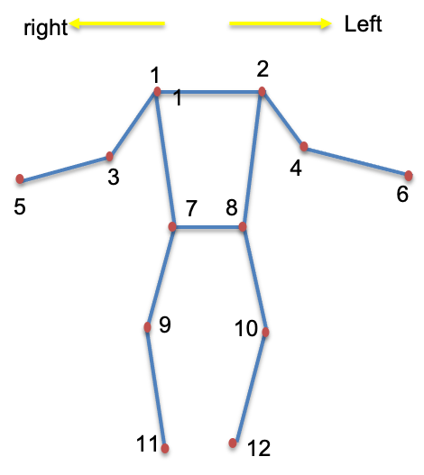
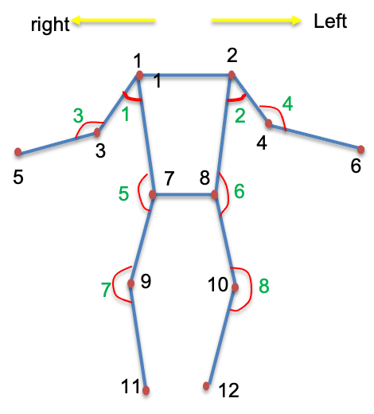
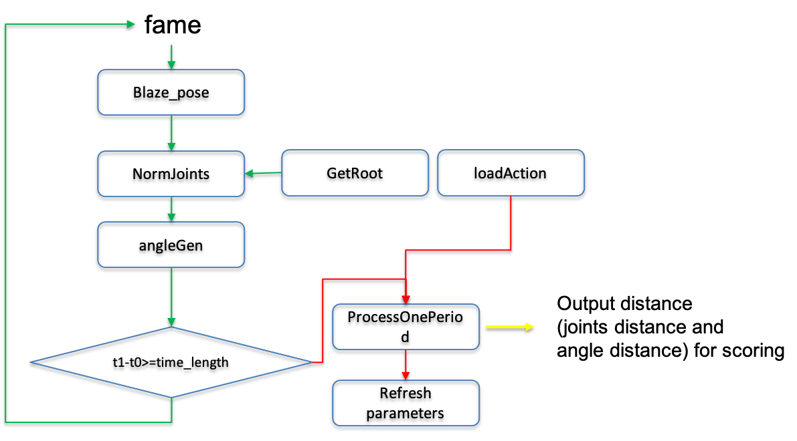
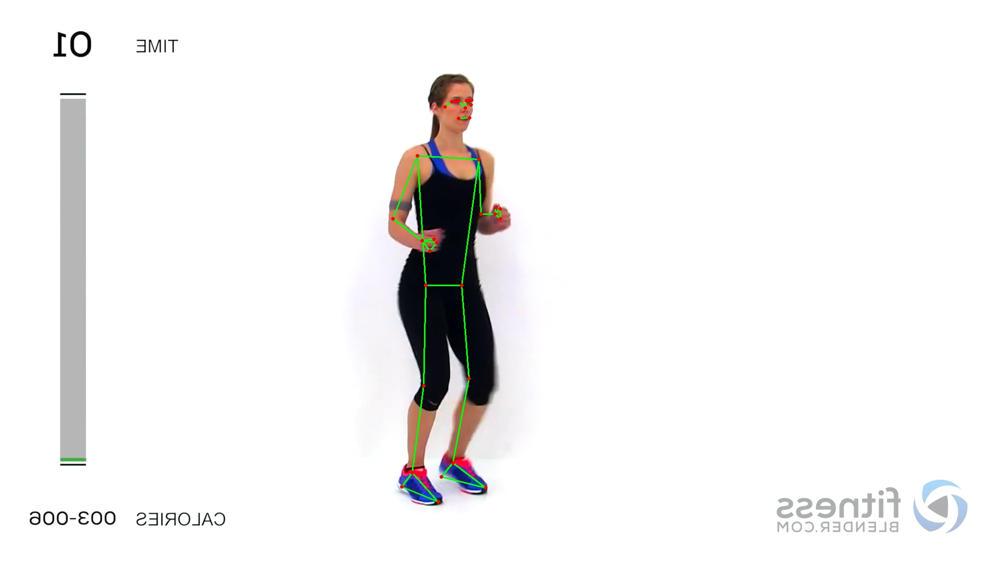
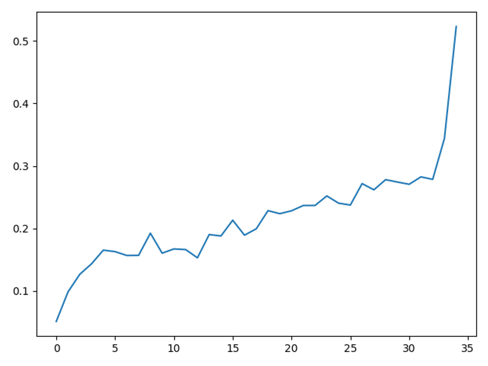
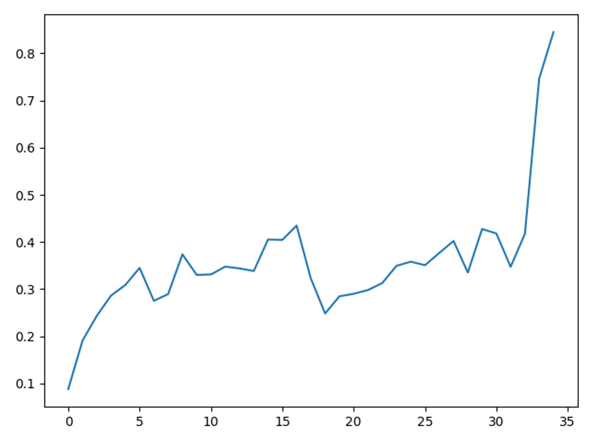

# # Human-Motion-Compare
implement the  human motion compare in serval seconds

# Ready
- transform the joints' order to defined order, which is show in the picture(in this rep, we use Blaze-pose to estimate the joints):12


- the defined angle is: (8 angles)



- for every motion,should define the weight of joints and angles in the comparation to value different importance

the shape is num_jointsx2, type is numpy,weight[:,0] is for 12 joints distance importance for one motion, and weight[:,1] is for 8 angles ,and end of weight[:,1] 4 elements are 0.  there are in [0,1].

```
#example:
weight=np.array([
    [1,1],
    [1,1],
    [0.5,1],
    [0.5,1],
    [0.5,1],
    [0.5,1],
    [0.5,0.5],
    [0.5,1],
    [0.5,0],  #angle weight is 0
    [0.5,0],  #angle weight is 0
    [0.5,0],  #angle weight is 0
    [0.5,0]   #angle weight is 0
])   #the invisible joints's weight is small

```

# The function's usage is in the utils.py
```
StandMotionPorcess(video_path,save_txt_path,mode='torso') #process the coach one motion, and mode parameter is for selecting root origin, there are 3 mode:'left_hip', 'right_hip' and 'torso'(default,detail is in the function note)

ProcessVideo(video_path,action_path,num_joints,frame_ratio,weight,mode='torso') #to process ordinary human motion in time, default num_joints=12, default frame_ratio is 30, and weight is defined by you. action_path is standard motion txt file path
```

# Process （coach motion）

# Process （student motion）




#experiments

- example video(contains 3 class motion)

  

- selected motion to be coach's motion(cut from the example video)

  

- results:（joints mean distance and angles mean distance）
    
